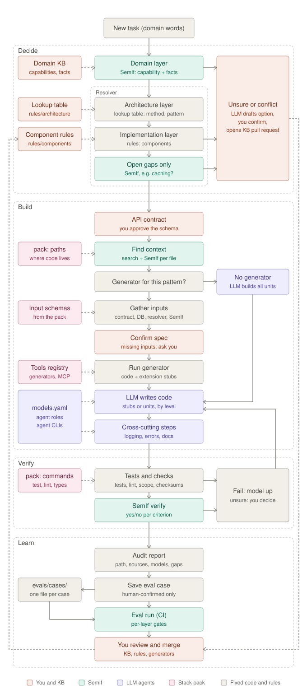

# harness

**A model-agnostic AI harness for building backend APIs: deterministic where it can be, AI where it must be, human-approved where it matters.**

> **Status: early development.** The design is in place ([architecture](docs/architecture.md), [plan](docs/plan.md)); the code is being built step by step. Nothing here is ready for real projects yet.

## Why

AI coding agents are powerful but unpredictable. Given the same task twice, they may design it differently, pick a different pattern, or forget a security check. For backend APIs most of that work is already well understood: a "create" endpoint needs validation, an insert and a response; data owned by a user needs an ownership check.

`harness` turns that knowledge into a **reviewed, versioned knowledge base** and uses AI only for the parts that genuinely need judgement.

## How it works



A task written in plain business language goes through four stages:

1. **Decide.** A small decision model ([SemIf](https://github.com/TheoLeeCJ/SemIf-OpenJev)) reads the business facts from the task: what entity, what operation, who uses it, how sensitive the data is. A deterministic **resolver** then derives the endpoint, pattern and components from rules in the knowledge base. Anything unclear goes to a human.
2. **Build.** Known patterns are produced by **code generators** from templates, so the same spec always gives the same code. LLM agents write only what templates can't, such as business rules, on whichever model fits the step.
3. **Verify.** Tests, lint and scope checks run, plus yes/no checks that the result meets each requirement. Failures retry with a stronger model; uncertain results go to a human.
4. **Learn.** Every run produces an audit report. Human-confirmed decisions become evaluation cases, and every knowledge-base change must pass them before it's merged.

## Key ideas

- **Human-approved knowledge.** New categories, rules and contracts are confirmed by a person, through pull requests.
- **Deterministic first.** Stated facts, then knowledge-base links, then rules, then AI, then a human, in that order.
- **Model-agnostic.** Agents are defined once and run on any model through Aider, Claude Code, Codex or Copilot; a config file maps task complexity to model.
- **Language-agnostic.** The core is Python; each backend stack (e.g. FastAPI, Express, Spring) plugs in as a *stack pack*.
- **Measured, not assumed.** Evaluations cover every layer, with zero tolerance for missed security components.

## Getting started

Requires [uv](https://docs.astral.sh/uv/).

```bash
git clone https://github.com/mitesh-tech/harness.git
cd harness
uv sync
uv run harness --help
```

Run the checks:

```bash
uv run pytest
uv run ruff check .
```

## Roadmap

The first milestone is a small end-to-end example: a "Bookstore" API where the harness classifies tasks, resolves the design, generates endpoints, verifies them and writes a report. See [docs/plan.md](docs/plan.md) for the full plan.

## Contributing

The project is at an early stage. Issues and ideas are welcome. All changes go through pull requests and need an approving review before merging.

## License

[Apache-2.0](LICENSE)
